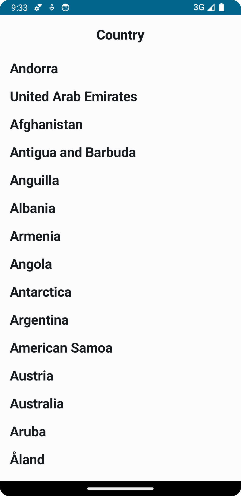
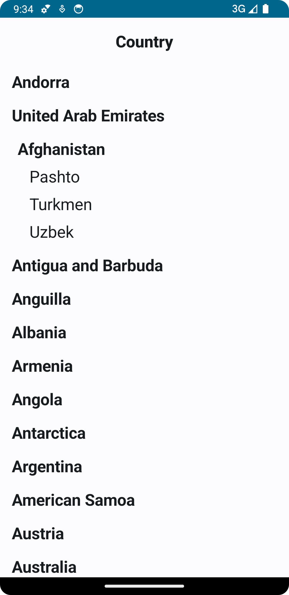

# Country Language App

## Description
This Android app displays a list of countries and their spoken languages. It follows the MVVM architecture and clean code principles, utilizing modern Android development tools such as Jetpack Compose, Hilt for dependency injection, and Room for local database management.

## Features
- Display a list of countries and their languages
- Expandable list items to show languages spoken in each country
- Clean architecture with MVVM pattern
- Dependency injection with Hilt
- Local data persistence with Room
- Network calls with Retrofit

## Architecture
The app is structured following the MVVM (Model-View-ViewModel) architecture and clean code principles:
- **View**: The UI layer built with Jetpack Compose.
- **ViewModel**: The presentation layer that handles the UI logic and state.
- **Model**: The data layer that includes the repository, data sources (remote and local), and data models.

## Libraries and Tools
- [Jetpack Compose](https://developer.android.com/jetpack/compose): Modern UI toolkit for Android.
- [Hilt](https://dagger.dev/hilt/): Dependency injection library for Android.
- [Room](https://developer.android.com/training/data-storage/room): SQLite database abstraction.
- [Retrofit](https://square.github.io/retrofit/): HTTP client for Android.
- [Kotlin Coroutines](https://kotlinlang.org/docs/coroutines-overview.html): For asynchronous programming.

## Testing

- Unit tests are written for the ViewModel and Repository layers to ensure the reliability of the app.
- (Optional) UI tests can be added to test the user interface and interactions.

## Screenshots

